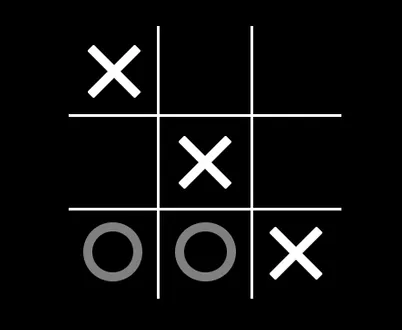

### A Simple Game of Tic-Tac-Toe

**Well the answer to that is**
> *Tic-tac-toe, noughts and crosses, or Xs and Os/“X’y O’sies”, is a paper-and-pencil game for two players, X and O, who take turns marking the spaces in a 3×3 grid. The player who succeeds in placing three of their marks in a diagonal, horizontal, or vertical row is the winner. - Wikipedia*

**What I have done is kept to the core of the game but moved it onto a platform where one is not limited to sitting in front of another person and holding onto a pen and paper. You can simply create a new game and share the details with a friend and tell him/her to join.**

The app is pretty straight forward. Visit the site, click on PLAY and you'll be greeted with a modal which has two parts -
- A New Game section where you have to enter any **Username** of your choice and just click on the New Game button
- The second section is for joining a game for which you will need to enter the **GameID** and the **Username**. The GameID is automatically generated for every new game.
Once you're done with that then its go time. the same tic-tac-toe we are used to playing as a child is now on your screen, be it mobiles, laptops or computers

#### Tech Stack
*My tech stack of choice for this little project was **NodeJS (Express)** for the backend and **ReactJS** with **Material UI** for the front end.*

#### Current Version and Future plans
*Currently it supports two player games pretty well. Although in the future, I do plan on adding a play against computer feature where you can essentially test your might against the program which will choose the squares based on some algorithm as well as maybe make some UI changes.*