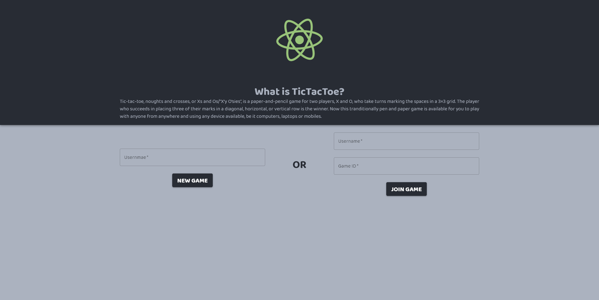
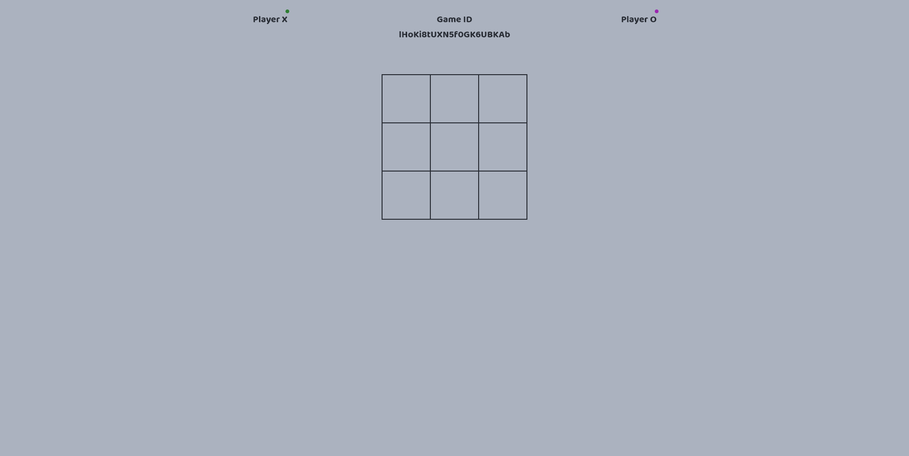
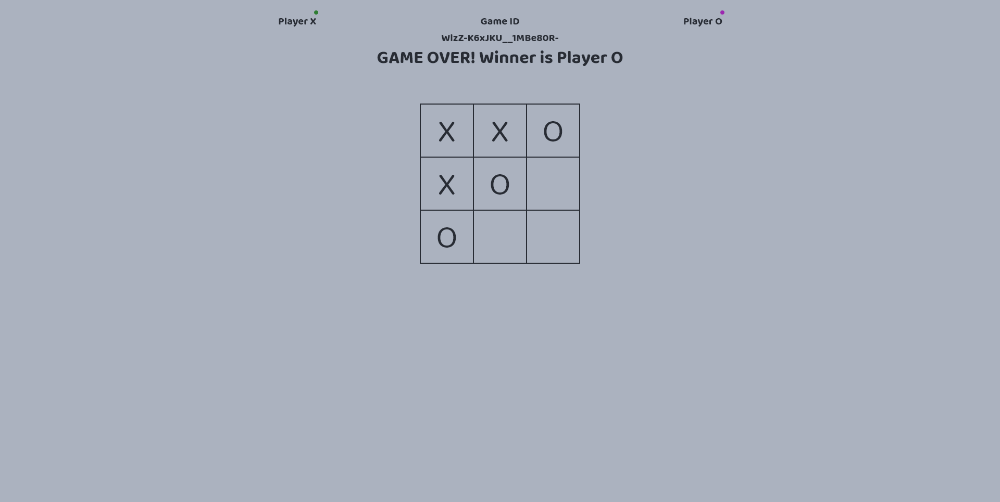

### A Simple Game of Tic-Tac-Toe




```bash
# Install dependencies for server
npm install

# Install dependencies for client
npm run client-install

# For windows - run the client & server with concurrently
npm run serve:dev:windows

# For Mac/Linux - run the client & server with concurrently
npm run serve:dev

# For Windows - run the Express server only
npm run start:dev:windows

# For Mac/Linux - run the Express server only
npm run start:dev

# Run the React client only
npm run client

# Server runs on http://localhost:5000 and client on http://localhost:3000
```

#### Tech Stack
*My tech stack of choice for this little project was **NodeJS (Express)** for the backend and **ReactJS** with **Material UI** for the front end.*

#### Current Version and Future plans
*Currently it supports two player games pretty well. Although in the future, I do plan on adding a play against computer feature where you can essentially test your might against the program which will choose the squares based on some algorithm as well as maybe make some UI changes.*